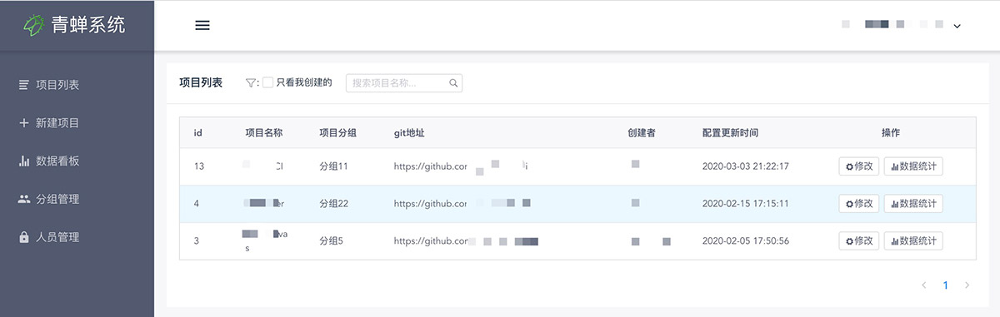
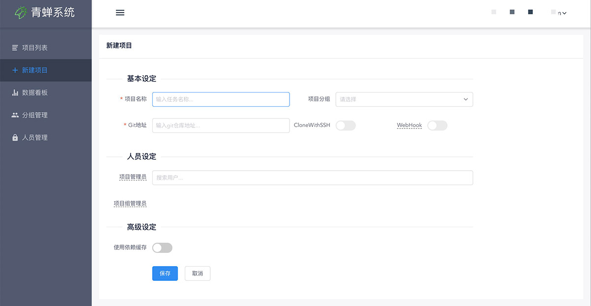
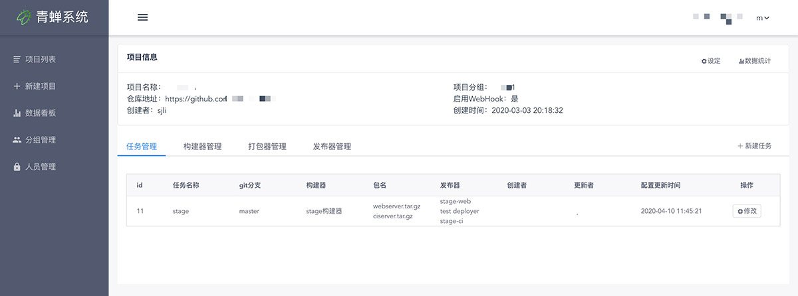
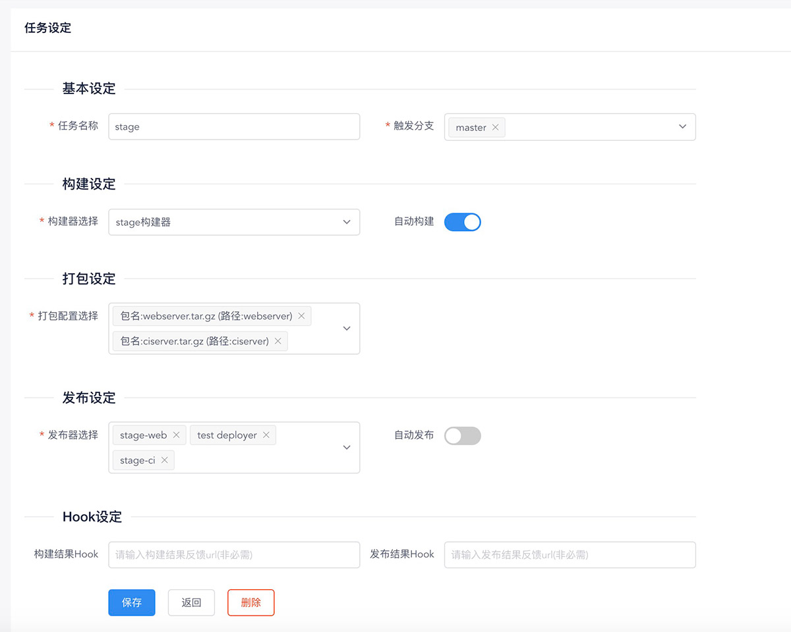
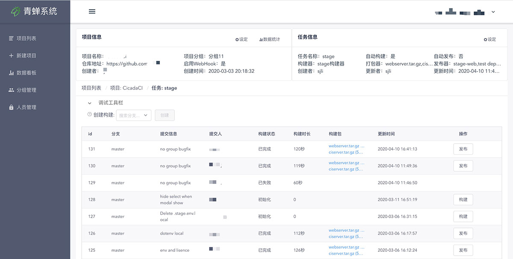
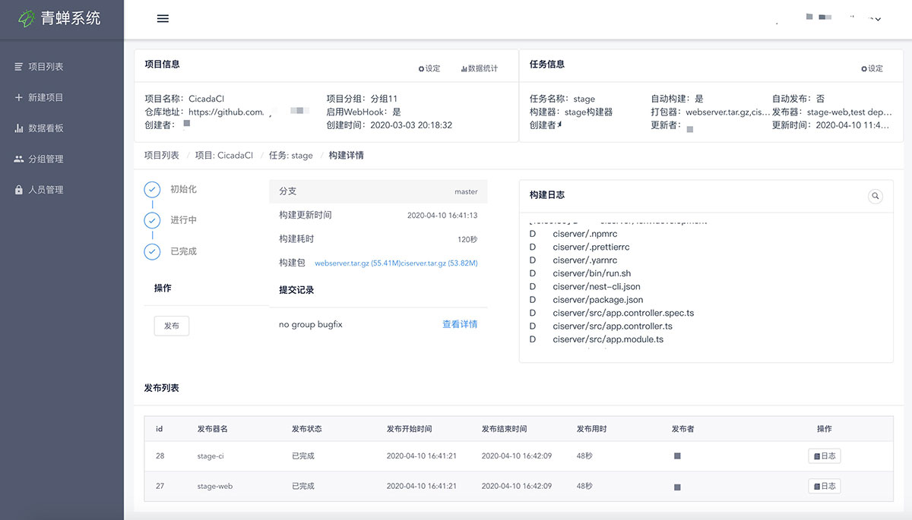

青蝉是一个致力于搭建前端云构建服务的开源项目。适用于搭建企业级的前端通用构建服务。
青蝉系统相对于传统的 jenkins，优点是更轻量级、更易于使用。默认整合基于 github 的 CI 流程，同时提供了标准化的可替代模块说明，用户可以快速地将该系统集成到企业内部 CI/CD 流程中。

## 术语说明

#### 项目

项目指以唯一 git 仓库为数据来源的模块集合，一个项目中可包含多个构建任务以及构建相关的其他模块，这些模块包括任务、构建器、打包器、发布器、构建记录、发布记录、数据统计等。

#### 任务

任务指关于代码如何构建与发布的各模块的集合，一个任务的配置中描述了构建与发布过程的相关配置，同时，通过该任务配置产生的历史构建也与该任务相关联。

#### 构建器

构建器指描述了构建过程中项目代码编译过程的相关脚本，一个项目中可以创建多个构建器，一个任务配置中只能选择一个构建器。

#### 打包器

打包器描述了构建过程中项目代码经过编译后对编译产物进行打包的相关配置，包含打包产物的名称与打包内容的路径。一个项目中可以创建多个打包器，一个任务配置中可以包含多个打包器

#### 发布器

发布器描述了构建结束后将构建包进行发布的相关脚本和配置，一个项目中可以创建多个发布器，一个任务配置中也可以包含多个发布器。

## 界面概览

#### 项目列表

#### 新建项目

#### 项目详情

#### 任务编辑

#### 任务详情

#### 构建记录

